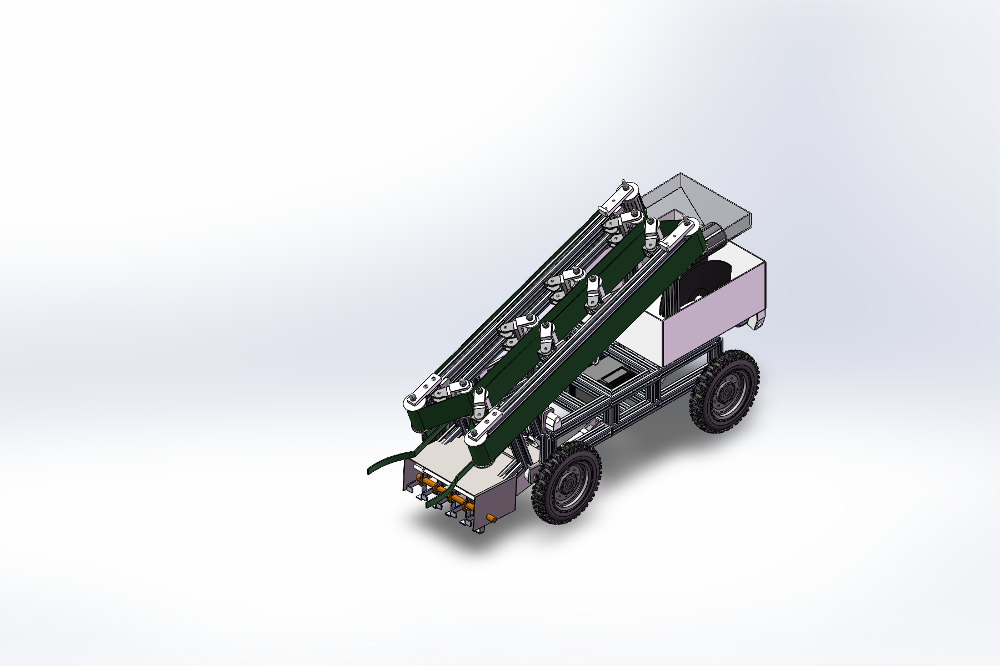

# 智能大葱收种一体机
# Smart Scallion Harvester–Planter

**机械结构设计作品集 · Mechanical Design Portfolio**

围绕大葱收获与种植作业的一体化机械方案，展示整机布局、型材车架、扶葱输送、弹簧张紧、翻土开沟及播种机构的 SOLIDWORKS 零件与装配设计。

A mechanical design concept integrating scallion harvesting and planting operations, with native SOLIDWORKS models covering the overall layout, profile frame, crop-guiding conveyors, spring tensioning, soil-working tools and planting mechanism.



> 图像直接导自本仓库模型的 SOLIDWORKS 视图。仓库定位为机械 CAD 设计展示；“智能”沿用项目概念名称，本次发布不包含控制程序、自动导航或田间试验数据。
>
> Images are exported directly from the repository's CAD models in SOLIDWORKS. This is a mechanical CAD portfolio. “Smart” is part of the project concept name; this release contains no control software, autonomous navigation implementation or field-test data.

**快速入口 / Quick links:** [机构详解 / Design walkthrough](docs/mechanical-design.md) · [模型打开指南 / Model guide](docs/model-guide.md) · [文件清单 / Inventory](docs/model-inventory.csv) · [核验记录 / Verification](docs/verification.md)

## 中文介绍

### 项目背景与方案

本项目围绕大葱收获、输送收集和种植相关作业，建立了一套共用移动底盘的机械结构方案。设计以型材车架为承载基础，将倾斜布置的收割输送组件、收集装置、翻土组件和播种组件整合到同一总装中，便于考察各机构的空间关系与安装接口。

机械设计重点在于作物流转路径与结构布置的协调：前端扶葱件与松土铲刀对应作物导入和根部松土位置；两侧输送带及导向滚轮形成向上输送通道；轴固定座、可调座、弹簧座和铰链构成滚轮支承与张紧调节结构；车架上的气缸和安装座提供作业组件的连接与调节接口。播种侧包含储存箱、播苗盘、圆盘、支撑型材及负重轮，翻土侧包含轴、翻土件、开沟件及起垄件。

最终交付是一套可查看整机及主要子机构的三维 CAD 模型，并保留 STEP 交换文件和已有工程图。设计意图依据实际零件、装配关系与可见几何说明；夹持力、张紧力、播种间距、工作效率及土壤适应性尚无本仓库内的试验数据支持。

### 建议技术读者重点查看

| 设计主题 | 模型中的具体内容 | 查看入口 |
| --- | --- | --- |
| 整机与承载结构 | 四轮布置、型材车架、横梁及多个机构安装位置 | `大葱收割机.SLDASM`、`车架.SLDPRT` |
| 扶葱与输送 | 扶葱/镜向扶葱、两侧倾斜输送带、多个导向滚轮、清土刷轮、松土铲刀 | `收割部分.SLDASM` |
| 滚轮支承与张紧 | 轴固定座、可调座、弹簧与弹簧座、活动铰链 | `输送带导向轮*.SLDASM` |
| 播种机构 | 储存箱、播苗盘、圆盘、支撑件、负重轮 | `播种部分.SLDASM` |
| 土壤作业机构 | 翻土、开沟、起垄件与共用轴的布置 | `翻土.SLDASM` |
| 装配接口 | 气缸及其安装座、轮组、轴承与标准紧固件 | 总装及配套子目录 |

## English overview

### Context and mechanical concept

This project develops a shared mobile platform for a scallion harvesting and planting concept. A frame built from structural profiles supports an inclined harvesting/conveying assembly, a collection unit, a soil-working assembly and a planting assembly. The CAD package lets reviewers examine how these mechanisms fit together and connect to the chassis.

The main design theme is the coordination of the crop path and mechanical layout. Front crop guides and soil-loosening blades define the entry region. Paired inclined belts and guide rollers form an upward conveying path. Shaft supports, adjustable mounts, spring seats and hinges form the roller-support and tensioning arrangement. Pneumatic cylinders and their mounting brackets provide mechanical connection and adjustment interfaces. The planting assembly includes a storage hopper, a planting drum/disc arrangement, supporting profiles and support wheels. The soil-working assembly includes a shaft with tilling, furrow-opening and ridging elements.

The deliverable is a three-dimensional CAD package for reviewing the complete machine and its main mechanisms, together with existing STEP exchange files and engineering drawings. Functional descriptions express design intent inferred from the actual parts, assembly relationships and visible geometry. Grip force, belt tension, planting spacing, throughput and soil performance have not been established by test data in this repository.

### Suggested technical review

Start with the overall layout and chassis interfaces, then inspect the crop-guiding conveyors, roller support and spring tensioning details. Continue with the planting and soil-working assemblies. The [illustrated walkthrough](docs/mechanical-design.md) maps these topics to exact filenames and explains the observed features in both languages.

## 获取与打开 / Download and open

1. 下载仓库完整 ZIP 并全部解压，或使用下方 Git 命令。Download and extract the entire repository ZIP, or clone it using the command below.
2. 用 SOLIDWORKS 打开 `cad/大葱收种一体机/大葱收割机.SLDASM`。Open this file as the main assembly in SOLIDWORKS.
3. 保留模型目录内的文件名和子目录。需要通用格式时可打开同目录的 `大葱收割机.STEP`。Preserve all filenames and subfolders. Use the existing `大葱收割机.STEP` for neutral-format viewing.

```bash
git clone https://github.com/Liiiin-hku/smart-scallion-harvester-planter.git
```

原模型目录完整保留，共 **217 个文件**：**86 个零件、18 个装配体、3 个工程图、110 个 STEP 文件**，合计 **221,436,406 字节（约 211.18 MiB）**。无需 Git LFS。文件数量不等于装配中的组件实例数量。

The original CAD directory is preserved with **217 files: 86 parts, 18 assemblies, 3 drawings and 110 STEP files**, totaling **221,436,406 bytes (approximately 211.18 MiB)**. Git LFS is not required. File counts differ from component-instance counts in an assembly.

## 版本与查看状态 / Version and viewing status

已在 **SOLIDWORKS 2025 SP3.0** 中只读打开总装与主要子机构并导出展示图。当前总装配置读取到 **346 个组件实例**，均为完全解析状态；其中 2 个实例来自同一个内嵌虚拟零件。总装引用链中的外部模型均位于本包内。

The main assembly and selected mechanisms were opened read-only in **SOLIDWORKS 2025 SP3.0** and used to export the illustrations. The active top-level configuration contains **346 fully resolved component instances**, including two instances of one embedded virtual part. External models in the main assembly's dependency chain resolve within this package.

原模型树仍有特征/配合警告；两个历史工程图及八个镜向铰链装配存在缺失引用，详见[模型指南](docs/model-guide.md#known-reference-gaps)。模型内容未作修复、改名、格式升级或重新保存。已有 STEP 文件未重新生成，不承诺与原生模型逐实体一致。

Existing feature/mate warnings remain. Two historical drawings and eight mirrored-hinge assemblies have missing references, detailed in the [model guide](docs/model-guide.md#known-reference-gaps). Native CAD content has not been repaired, renamed, upgraded or resaved. Existing STEP files have not been regenerated or checked for entity-by-entity equivalence with the native models.

## 仓库结构 / Repository structure

```text
.
├── README.md                    # 中英文项目介绍 / Bilingual introduction
├── LICENSE                      # CERN-OHL-P-2.0
├── NOTICE.md                    # 许可范围与来源说明 / Scope and provenance
├── cad/
│   └── 大葱收种一体机/           # 原文件名、目录及内容 / Preserved CAD package
│       ├── 大葱收割机.SLDASM     # 总装入口 / Main assembly
│       ├── 大葱收割机.STEP       # 原有交换模型 / Existing neutral model
│       ├── 标件/                # 标准件与铰链 / Hardware and hinges
│       ├── 轮子/                # 轮组 / Wheel assembly
│       └── 不锈钢迷你型CTMA系列气缸[…]/  # 原气缸目录 / Original cylinder folder
└── docs/
    ├── images/                  # 原模型视图 / Direct CAD view exports
    ├── mechanical-design.md     # 机构详解 / Design walkthrough
    ├── model-guide.md           # 打开方法与历史引用问题 / Viewing guide
    ├── verification.md          # 核验范围 / Verification scope
    ├── dependency-audit.json    # 装配/工程图引用清单 / Dependency audit
    ├── model-inventory.csv      # 全部模型清单与哈希 / Inventory with hashes
    └── SHA256SUMS.txt           # 模型完整性校验 / CAD integrity checksums
```

## 开源许可 / Open-source licence

仓库所有者有权许可的原创机械设计贡献及本仓库项目文档采用 **[CERN Open Hardware Licence v2 — Permissive](LICENSE)**。标准件、轮组和供应商型气缸等模型不因本次整理而被主张为原创；其既有权利与适用条款保持不变。具体范围见 [NOTICE.md](NOTICE.md)。

Original mechanical-design contributions licensable by the repository owner and the accompanying project documentation are released under **[CERN Open Hardware Licence v2 — Permissive](LICENSE)**. Standard hardware, wheel models and supplier-style pneumatic components are not claimed as original work through this publication; existing rights and applicable terms remain unchanged. See [NOTICE.md](NOTICE.md) for scope.

维护者 / Maintainer: [Liiiin-hku](https://github.com/Liiiin-hku)
