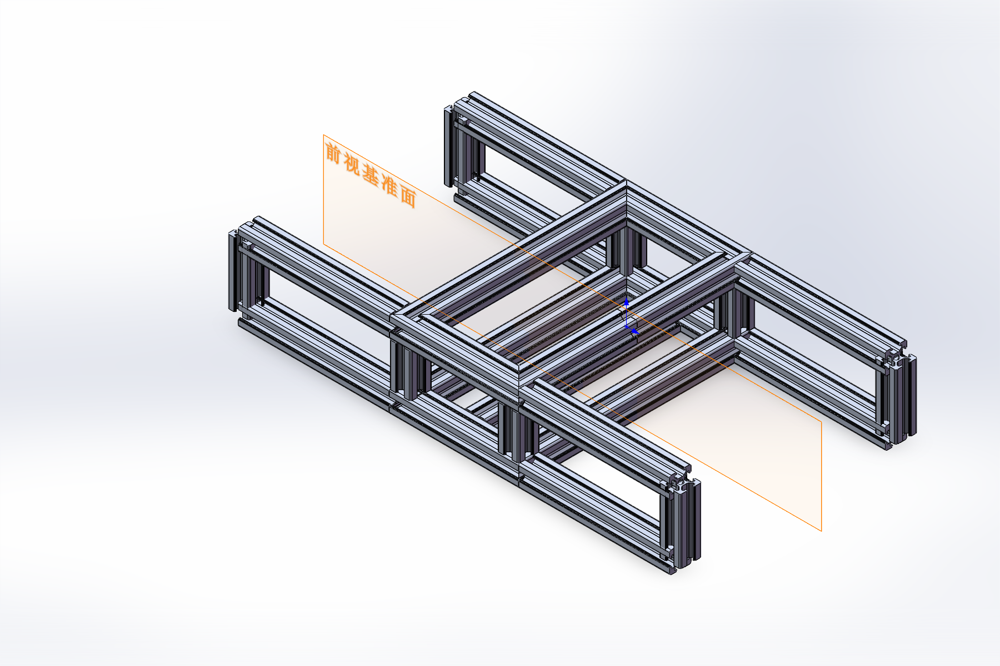
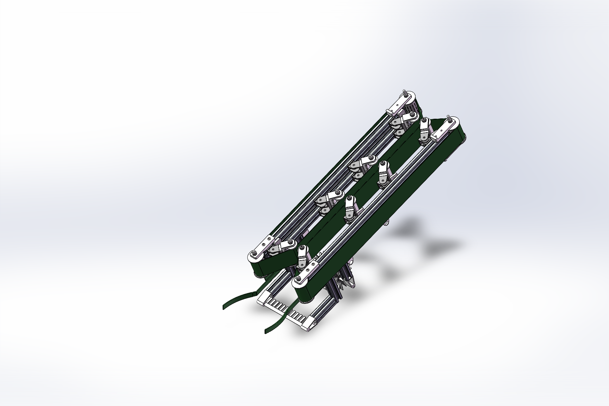
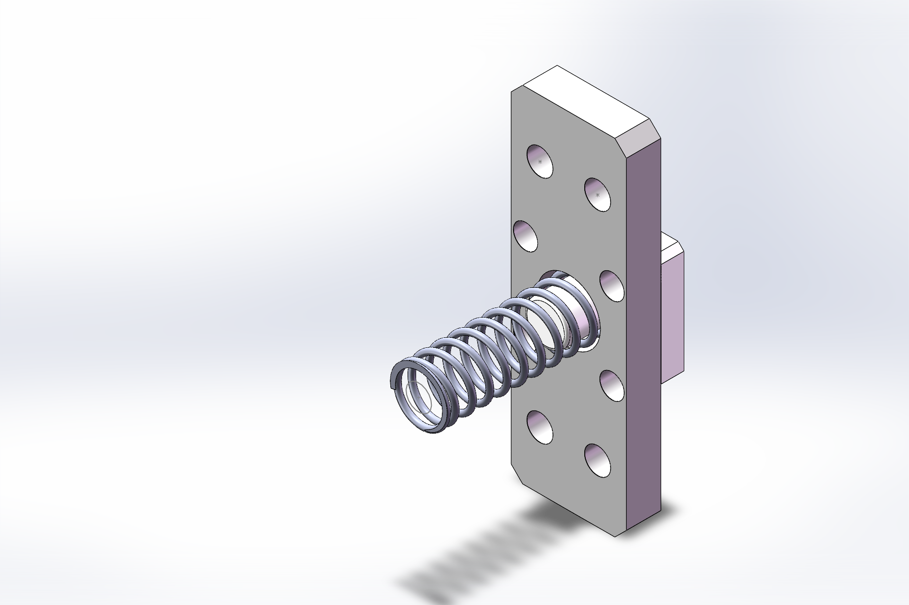
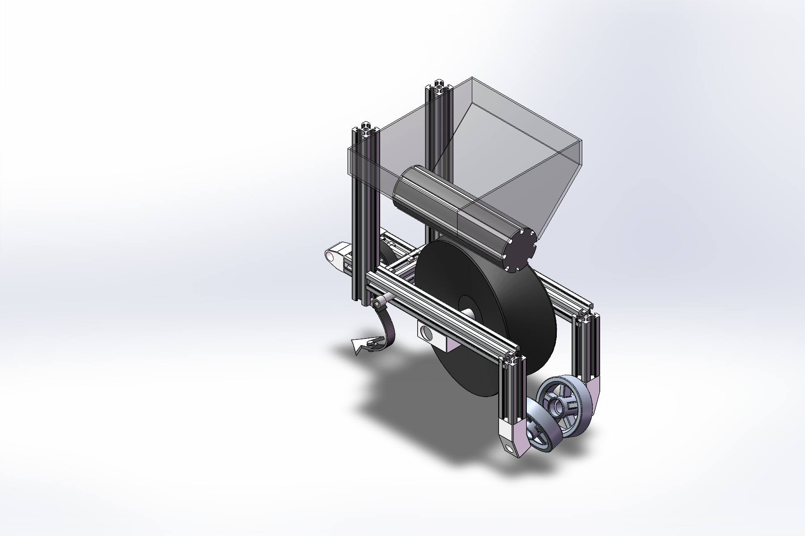
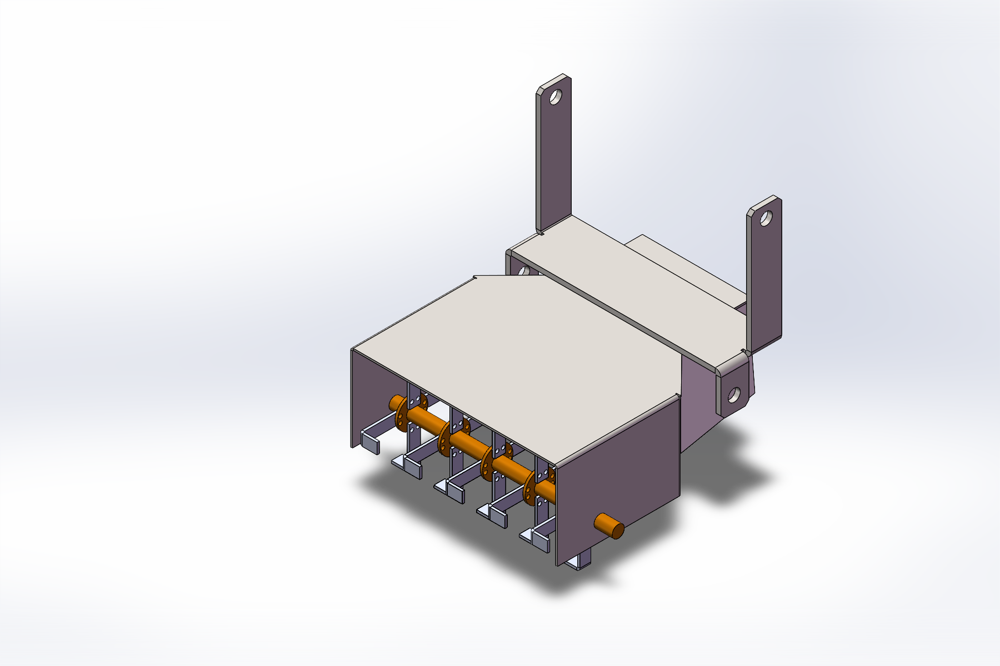

# 机械结构详解 / Mechanical design walkthrough

[返回项目首页 / Back to project](../README.md)

以下说明来自总装、主要子装配、零件名称与实际 SOLIDWORKS 视图。关于作业功能的解释属于机械设计意图，不能替代运动分析、强度计算或样机测试。

This walkthrough is grounded in the main assembly, selected subassemblies, part names and direct SOLIDWORKS views. Explanations of operating functions describe mechanical intent; they do not replace motion analysis, structural calculations or prototype testing.

## 1. 整机布局与型材车架 / Overall layout and profile frame

入口：`大葱收割机.SLDASM`、`车架.SLDPRT`、`轮子/23. Tyre Sub Assembly.SLDASM`。

车架由纵向型材、横梁、竖向连接段与两侧外伸支承位置构成。总装中布置四个轮组，并通过车架及气缸安装座连接上方输送机构和其他作业部件。该模型适合讨论梁件布局、机构支承位置、安装孔/连接件的可接近性，以及各子机构与底盘的空间关系。具体型材材料、承载能力与安全系数需要材料定义和工况计算支持。

The chassis combines longitudinal profiles, cross-members, vertical connections and lateral support locations. Four wheel assemblies are present in the overall assembly. Frame and cylinder brackets connect the elevated conveyor structure and the other working modules. The model supports discussion of beam layout, support locations, fastener access and packaging around the chassis. Material properties, load capacity and safety factors require separate evidence.

## 2. 扶葱、松土与倾斜输送 / Crop guiding, soil loosening and conveying

入口：`收割部分.SLDASM`。主要零件包括 `扶葱.SLDPRT`、`镜向扶葱.SLDPRT`、`松土铲刀.SLDPRT`、`输送带.SLDPRT`、`清土刷轮.SLDPRT` 及相应型材支撑。

前端成对导向件形成作物进入的位置，两侧输送带沿倾斜型材布置，多组滚轮沿输送路径分布。下方的松土铲刀和刷轮对应松土与清土设计位置。结合后部收集装置，可以理解其将作物导入、向上输送再收集的设计路径。输送方向及夹持/清土效果需由后续驱动布置、转速与作物试验确认。

Paired front guides define the crop-entry region. Two belts run along inclined supporting profiles, with multiple rollers distributed along the conveying path. Soil-loosening blades and cleaning rollers occupy the lower working region. Together with the collection unit, this suggests a crop-guiding, upward-conveying and collection path. Actual belt direction, gripping behaviour and cleaning performance require drive specifications and crop tests.

## 3. 滚轮支承与弹簧张紧 / Roller support and spring tensioning

入口：`输送带导向轮.SLDASM`、`输送带导向轮2.SLDASM`、`输送带导向轮2张紧.SLDASM`。

原模型把滚轮轴及轴承、轴固定座、调节座和弹簧座等拆分为可独立查看的零件/子装配。图示张紧子装配中可见安装板、支承件和螺旋弹簧；在收割总成中，可进一步查看它与滚轮和活动铰链之间的连接。其结构意图是为输送带滚轮提供支承和弹性调节，实际预紧量、行程、弹簧刚度及张紧力未在此次展示中定量验证。

Roller shafts, bearings, fixed and adjustable mounts, and spring seats are separated into inspectable parts and subassemblies. The illustrated tensioning subassembly contains a mounting plate, a support element and a helical spring. The harvesting assembly shows how these elements connect to the rollers and hinges. The arrangement suggests roller support with compliant adjustment; preload, stroke, spring rate and belt tension have not been quantitatively verified here.

## 4. 播种与支承组件 / Planting and support assembly

入口：`播种部分.SLDASM`。主要零件包括 `储存箱子.SLDPRT`、`储存箱子支撑.SLDPRT`、`播苗盘.SLDPRT`、`盘.SLDPRT`、`负重轮.SLDPRT`、`负重轮座.SLDPRT`、`Spike Gribe.SLDPRT`。

模型可见上方储存箱、水平圆筒形播苗件、竖向圆盘、型材支撑以及下部支承轮。通过这些部件，可讨论储存/供料位置、播苗部件的安装方向与对地支承。原文件名称采用“播种/播苗”，本仓库沿用这一称呼；仅凭静态 CAD 不把它进一步定性为已验证的精量播种或自动移栽机构。

Visible features include an upper storage hopper, a horizontal cylindrical planting element, a vertical disc, supporting profiles and lower support wheels. These allow reviewers to examine storage/feed positioning, mounting orientation and ground-support geometry. The original files use planting/seedling-related names. Static CAD alone does not establish precision seeding or automated transplanting performance.

## 5. 翻土、开沟与起垄 / Tilling, furrow opening and ridging

入口：`翻土.SLDASM`。主要零件包括 `翻土.SLDPRT`、`开沟.SLDPRT`、`起垄.SLDPRT`、`起垄座.SLDPRT`、`轴.SLDPRT`。

图中可见板件围合结构、带多组重复作业件的共用轴，以及上部安装连接板。该模块集中体现了轴系布置、多个作业件的轴向排列和模块与整机的连接方式。零件名称对应翻土、开沟与起垄功能；入土深度、土壤阻力、堵塞风险及各工序能否连续协同仍需工况分析与试验。

The assembly shows a plate enclosure, a common shaft carrying repeated working elements and upper mounting plates. It illustrates shaft layout, axial spacing of tools and attachment to the overall machine. Part names correspond to tilling, furrow opening and ridging. Working depth, soil resistance, clogging and coordination between operations require further analysis and testing.

## 6. 气缸接口与标准件集成 / Cylinder interfaces and standard components

总装包含四个 CTMA 系列气缸实例、多个气缸座与后铰固定架。配套目录保留了气缸、杆端、紧固件、轴承、铰链和轮组模型。它们用于展示结构接口、连接关系和装配空间；目录中的供应商型号及标准代号不是本项目对其原创性的声明，也不能替代采购规格或选型计算。

The main assembly contains four CTMA-series cylinder instances, several mounting brackets and rear clevis supports. Supporting directories retain cylinder, rod-end, fastener, bearing, hinge and wheel models. They document mechanical interfaces and assembly space. Supplier-style identifiers and standard designations do not imply project authorship of those components or replace procurement specifications and sizing calculations.
